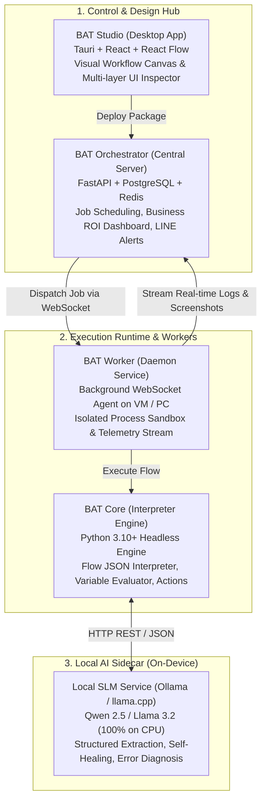
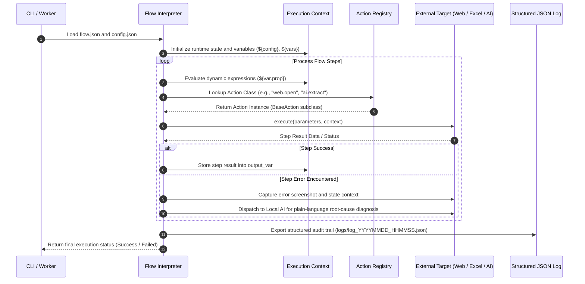

# BAT Automate

[-orange.svg?style=flat-square)](#)
[](#)
[](#)
[](LICENSE)

> **Project Status: Active Development (Pre-Alpha / Work-in-Progress)**  
> BAT Automate is currently under rapid, active development. Core engine APIs, subflow execution specifications, and action schemas are evolving. It is not yet intended for mission-critical production deployments. Community feedback and contributions are warmly welcome!

> **Open-Source, Local AI-Native Agentic Automation Framework**  
> Next-generation Enterprise RPA powered by Python and on-device Small Language Models (SLMs). Eliminate commercial licensing overhead with autonomous agent workflows, zero-license Excel automation, and 100% free unattended robot workers.

---

## 1. Key Highlights & Core Philosophy

- **Local AI-Native Architecture:** Architected from the ground up for on-device Small Language Models (SLMs) running 100% locally on CPU (e.g., Qwen 2.5, Llama 3.2 via Ollama or GGUF). Powers autonomous entity extraction, self-healing UI selectors, and plain-language root-cause diagnosis with zero API token costs and complete data privacy.
- **Zero-License Office Dependency:** No Microsoft 365 or Microsoft Excel installation required for spreadsheet operations. High-performance file-level processing is natively handled via `openpyxl` and `pandas`.
- **Business-First Mindset:** Telemetry and executive dashboards emphasize tangible business outcomes: Return on Investment (ROI), total hours saved, and cost reductions rather than pure technical stack traces.
- **Free Unlimited Unattended Workers:** Deploy robot worker daemons across any existing VMs, PCs, or edge devices with zero per-bot monthly licensing fees.
- **Python Power and Extensibility:** Clean plugin architecture (`BaseAction`) seamlessly integrating Web automation (Playwright), REST APIs, SQL databases, and AI models.

---

## 2. System Architecture (4 Core Modules)

BAT Automate is designed as a decoupled, multi-tier ecosystem:



### Module Roles and Responsibilities

| Module | Scope and Role | Primary Technology Stack |
| :--- | :--- | :--- |
| **BAT Core (`bat-core`)** | Headless runtime engine, flow interpreter, variable context evaluator, and action plugins | Python 3.10+, Playwright, Pandas, OpenPyXL, Pydantic |
| **BAT Studio (`bat-studio`)** | Visual drag-and-drop workflow designer, step debugger, and multi-layer selector recorder | Tauri, React, React Flow, TypeScript |
| **BAT Orchestrator (`bat-orchestrator`)** | Central management hub, cron/trigger scheduler, executive ROI analytics, and multi-channel alerts | FastAPI, PostgreSQL, Redis, React Dashboard |
| **BAT Worker (`bat-worker`)** | Background daemon deployed on execution targets receiving jobs via WebSocket | Python Service, WebSocket Client |

---

## 3. Core Engine Execution Pipeline

The execution engine (`bat-core`) follows a deterministic, observable execution pipeline:



---

## 4. Project Bundle Architecture

Automations are packaged as self-contained Project Bundles, ensuring that dependencies, assets, configurations, and subflows remain fully isolated:

```text
flows/
├── @shared/                                # Cross-project reusable subflows (LINE Alert, SSO Login)
│   └── line_notify.json
└── examples/
    ├── rpachallenge/                       # Classic form-filling benchmark
    └── rpachallenge_ocr/                   # OCR & AI invoice extraction benchmark
        ├── flow.json                       # Main workflow entry point
        ├── config/
        │   └── config.json                 # Environment and model parameters
        ├── subflows/                       # Subroutines invoked via flow.call
        ├── assets/                         # Local project assets and sample invoices
        └── output/                         # Execution results and generated CSV files
```

### Unattended Deployment Lifecycle
1. **Local Development:** Author and test flows locally using relative paths and CLI runners.
2. **Packaging:** Bundle the project directory into a unified package archive (`.batpkg` / `.zip`) including required `@shared/` dependencies.
3. **Distribution & Cache:** Worker nodes fetch and cache bundles from the central Orchestrator.
4. **Sandbox Execution:** Extract the bundle into an isolated temporary workspace per execution run.
5. **Telemetry Streaming:** Run via `bat-core` while streaming logs, metrics, and error screenshots back to the dashboard.

---

## 5. Local AI Integration (Ollama & Small Language Models)

BAT Automate adopts a **Decoupled Sidecar Architecture** for AI. The core engine remains lightweight and fast, while offloading cognitive tasks to a local inference runtime:

- **Supported AI Actions:**
  - `ai.prompt`: Send text prompts to Ollama with guaranteed JSON schema output (`format: "json"`).
  - `ai.extract`: Extract structured entity fields from unstructured text or image files (Base64 encoding).
- **Featured Example:**
  - Check out [flows/examples/rpachallenge_ocr/](flows/examples/rpachallenge_ocr/) for an automated flow that downloads invoice images via Playwright and extracts data using local Qwen 2.5 via Ollama.

---

## 6. Agent-to-Agent (A2A) Communication Protocol (Hybrid Protocol)

For multi-agent collaboration between the **Agent Orchestrator** and **Agent Worker**, BatAutomate defines the **Hybrid Protocol**:

- **Transport & State Envelope (WebSocket/JSON):** Real-time, bi-directional network messaging using structured JSON envelopes. Provides deterministic state tracking (`status`, `job_id`, `metrics`, error codes) with millisecond latency and zero hallucination risk.
- **Cognitive Agent Payload (Markdown inside JSON):** An `agent_report_md` payload field delivers natural-language Markdown summaries for AI agents and human oversight. Orchestrator agents parse this report to autonomously determine recovery steps (e.g., auto-retry vs. human escalation).

```text
[ Worker Agent (e.g. Raspberry Pi) ]
               |
               |  Persistent Bi-directional WebSocket
               v
{
   "type": "JOB_REPORT",
   "job_id": "job_20260916_001",
   "status": "FAILED",                       <-- JSON State Envelope (Fast, Deterministic)
   "duration": 14.2,
   "agent_report_md": "# Incident Summary\n" <-- Markdown Cognitive Payload (For LLMs & Humans)
                      "- **Root Cause:** Target input selector shifted dynamically.\n"
                      "- **Recommendation:** Trigger Self-Healing Selector Action."
}
               |
               v
[ Orchestrator Agent (Server Hub) ]
```

---

## 7. Repository Layout

```text
BatAutomate/
├── bat-core/                   # Python Package Module (Runtime Engine)
│   ├── pyproject.toml          # Package metadata & build configuration
│   ├── requirements.txt
│   ├── batautomate/            # Core Python Package
│   │   ├── actions/            # Web (Playwright), Excel, API, Logic, AI (Ollama)
│   │   ├── engine/             # Flow Interpreter, Variable Context, Evaluator, Logger
│   │   ├── models/             # Flow JSON Schema (Pydantic models)
│   │   └── cli.py              # CLI Runner (batautomate)
│   └── tests/                  # Pytest unit tests (29 passing tests)
│
├── docs/                       # Architecture Guides and References
│   ├── actions_reference.md    # Complete action reference manual
│   ├── cli_guide.md            # CLI commands and parameters
│   ├── project_bundles.md      # Modular project bundles and lifecycle
│   └── logging.md              # Structured logging and error telemetry
│
├── flows/                      # Workflows & Self-Contained Project Bundles
│   ├── @shared/                # Reusable subflows
│   └── examples/               # Example project bundles (rpachallenge, rpachallenge_ocr)
│
├── logs/                       # Central Structured Execution Logs
├── bat-studio/                 # Visual Flow Designer & UI Inspector (Active)
├── bat-orchestrator/           # Central Control Hub & Business Dashboard (Planned)
└── bat-worker/                 # Unattended Robot Daemon (Verified on RPi 4)
```

---

## 8. Development Roadmap

- [x] **Phase 1: Foundation & Core Engine (`bat-core`)**
  - [x] Flow JSON Schema and Pydantic v2 data models
  - [x] Flow Interpreter, execution context manager, and dynamic variable evaluator (`${var}`)
  - [x] Standard Action libraries: Web (Playwright), Excel (`openpyxl`), Logic, HTTP API, Email
  - [x] Hierarchical Structured Logging (`logs/<flow>/<date>/<time>.json`)
  - [x] Global CLI & Smart Flow Resolver (`batautomate list`, `batautomate run <flow_name>`)
  - [x] Modular Project Bundle Architecture (`flow.call`, `@shared/` namespace, `config.json`)
  - [x] Local AI Actions (`ai.prompt`, `ai.extract` with Ollama) and Playwright download action (`web.download`)
- [ ] **Phase 2: Developer Studio & Step Inspector (`bat-studio`)**
  - [x] Backend API service (FastAPI) for flow discovery, schema validation, and step mutation
  - [x] Modern 3-Column Developer Studio interface (Vite + React, Steps Timeline, Step Inspector, Live Context)
  - [ ] Persistent browser session & isolated step execution (`POST /api/session/step`)
  - [ ] Multi-layer UI element inspector (XPath, CSS, Text)
  - [ ] GitOps CI/CD deployment pipeline (declarative flows version-controlled and deployed via Git)
- [ ] **Phase 3: Central Server & Business Dashboard (`bat-orchestrator`)**
  - [ ] High-performance REST API (FastAPI) + PostgreSQL + Redis queue
  - [ ] Executive Business Dashboard: ROI calculations, hours saved tracking, transaction audit trail
  - [ ] Multi-channel alerts on failures and daily digests (LINE Messaging API priority, Teams, Email)
- [ ] **Phase 4: Unattended Agent Daemon (`bat-worker`)**
  - [ ] WebSocket agent daemon connecting worker nodes to Orchestrator
  - [ ] Isolated process runner, real-time log streaming, and failure screenshot capture
- [ ] **Phase 5: Desktop Automation & Community Open Source Release**
  - [ ] Native Windows desktop automation integration (`uiautomation`)
  - [ ] 1-Click Docker Compose deployment and GitHub community quickstart documentation
- [ ] **Phase 6: Advanced Local Agentic Capabilities**
  - [ ] Full Self-healing UI selectors with automatic DOM fallback matching
  - [ ] Studio Copilot for natural language flow generation

---

## 9. Prerequisites & System Requirements

Before installing and running BAT Automate, ensure your system meets the following requirements:

### Core Requirements
| Component | Minimum Version | Notes |
| :--- | :--- | :--- |
| **Python** | `3.10` or higher | Recommended `3.10` - `3.12` with `pip` and `venv` |
| **Git** | `2.30+` | Required for version control and GitOps flow deployments |
| **Operating System** | Windows 10/11, Ubuntu 20.04+, Debian 11+, Raspberry Pi OS (64-bit), macOS 12+ | Fully cross-platform |

### Platform-Specific Setup

#### Linux / Ubuntu / Debian / Raspberry Pi (64-bit)
On Linux environments, ensure system packages and Playwright browser shared libraries are installed:
```bash
# 1. Install system packages and python venv
sudo apt update
sudo apt install -y git python3 python3-pip python3-venv

# 2. Install Playwright Chromium with Linux system dependencies (libnss3, libasound2, etc.)
playwright install --with-deps chromium
```

#### Windows
Ensure Python 3.10+ is installed with **"Add python.exe to PATH"** checked. Install Playwright browser binaries with:
```powershell
batautomate install-browsers
# or: playwright install chromium
```

### Optional Dependencies
- **Local AI Inference (for `ai.prompt`, `ai.extract`):** Install [Ollama](https://ollama.com/) and run a local model:
  ```bash
  ollama run qwen2.5:1.5b
  ```
- **BAT Studio Web UI Development:** [Node.js 18+](https://nodejs.org/) and `npm` (only required if developing or building `bat-studio/frontend`).

---

## 10. Quick Start (CLI)

### Installation

Clone the repository and install the modules in editable mode within your Python virtual environment:

```bash
# Clone repository from dev branch
git clone -b dev https://github.com/arttopix/BatAutomate.git
cd BatAutomate

# Create and activate virtual environment
python3 -m venv .venv
source .venv/bin/activate  # On Windows: .venv\Scripts\Activate.ps1

# Install core engine and worker daemon in editable mode
pip install -e ./bat-core -e ./bat-worker
```

### Verification & Execution

```bash
# Check installed version and runtime info
batautomate version
batworker info

# List available flows (clean, deduplicated view)
batautomate list

# Run the RPA Challenge benchmark (auto-compiles flow.md if needed)
batautomate run rpachallenge

# Run with unattended worker daemon
batworker run flows/examples/rpachallenge/
```

---

## 11. Documentation

Detailed architectural specifications, execution manuals, and standards are available in the [`docs/`](docs/) directory:

- **[Actions Reference Manual](docs/actions_reference.md):** Complete catalog of built-in actions, parameters, and examples.
- **[Flow Markdown Specification](docs/flow_markdown_spec.md):** The official rulebook, syntax rules, and compilation contract for `flow.md`.
- **[CLI Execution Guide](docs/cli_guide.md):** Guide to `batautomate` CLI commands, parameters, and Smart Flow Resolver mechanics.
- **[Modular Project Bundles](docs/project_bundles.md):** Self-contained flow packages, subflows, and unattended worker execution lifecycle.
- **[Structured Logging Standards](docs/logging.md):** Hierarchical JSON log format, privacy sanitization, and error telemetry.

---

## 12. License

This project is licensed under the terms of the Open Source [MIT License](LICENSE).
